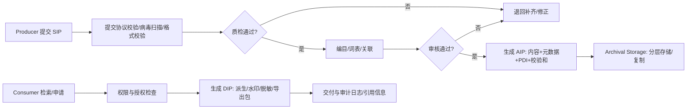

# 1. 一页摘要（结论先行）
## 1.1 一句话结论
建设一套面向博物馆数字资源的 DAMS，覆盖“采集/导入→质检→编目→审核→入库→检索→授权/交付→长期保存”，并以 OAIS（SIP/AIP/DIP + 六大功能域）组织能力，补齐可复用的提交协议、元数据/词表、访问分级与可信存储库治理（CoreTrustSeal）要求。

## 1.2 背景（Situation）
- 数字资源类型多（图片/音视频/3D/文档/档案），来源多（馆内采集、外部合作、历史迁移）。
- 多角色协作（采集、编目、审核、版权、研究、展陈、系统管理），跨流程节点多。
- 长期保存诉求增强：可理解、可追溯、可验证完整性、可控对外交付。

## 1.3 主要矛盾/痛点（Complication）
- 资源分散、命名与版本混乱；元数据不一致导致检索困难。
- 版权/授权证明链路缺失或不可追溯；对外导出风险高。
- 存储侧缺乏“校验和 + 定期完整性校验 + 修复事件记录”闭环。
- 缺少标准化的“提交协议/交付包”定义，导致入库质量不可控。

## 1.4 关键问题（Question）
如何让资源从“进入系统”到“长期保存可用”全过程可控，并能对不同用户生成合规可用的交付包？

## 1.5 本期结论（Answer）
- 以 OAIS 定义信息包：SIP（提交包）→ AIP（保存包）→ DIP（分发包），并按六大功能域拆模块：Ingest / Archival Storage / Data Management / Preservation Planning / Access / Administration。
- 引入“提交协议 + 入库质检规则 + 元数据模板/词表 + 访问分级/许可 + PID/引用”机制（参照 CESSDA/ICPSR/DMEG 的数据归档实践）。
- 以 CoreTrustSeal 的可信存储库要求作为治理与非功能对标（组织、数字对象管理、技术与安全）。

# 2. 术语与参考标准
## 2.1 术语表
- SIP：Submission Information Package，提交包（生产者提交给系统的原始内容 + 必要文档/声明）。
- AIP：Archival Information Package，保存包（系统长期保存的内容 + 保存所需元数据 + 校验信息 + 事件记录）。
- DIP：Dissemination Information Package，分发包（按权限与用途从 AIP 派生的交付物）。
- 指定社区（Designated Community）：系统承诺“可理解、可使用”的用户群及其知识边界。
- 表示信息（Representation Information）：让比特可理解的格式/解码/说明信息。
- PDI：Preservation Description Information，保存描述信息（至少含标识、来源/责任、完整性、版本与事件）。
- PID：持久标识（如 DOI/URN/Handle 等），用于标识资源/数据集/版本，支持引用与追溯。

## 2.2 标准名称-核心内容-作用
| 标准名称 | 核心内容 | 作用 |
|---|---|---|
| OAIS (ISO 14721) | 开放档案信息系统参考模型 | 通用功能架构与信息包模型，用于设计长期保存与交付闭环。 |
| DDI (Data Documentation Initiative) | 数据文档规范 | 社会科学领域常用元数据规范；本系统以“可理解/可复用”为目标，可借鉴其“字段级描述、缺失值、变量口径”方法论。 |
| CoreTrustSeal | 受信任数字存储库要求 | 可信存储库 16 条核心准则，对标组织治理、数字对象管理、技术与安全。 |

## 2.3 参考指南（落地方向）
- CESSDA Data Archiving Guide（DAG）：提交协议、访问分级、许可、元数据与发现、SIP/AIP/DIP 与 OAIS 对齐。
- Guide to Social Science Data Preparation and Archiving（ICPSR）：数据与文档准备清单、可独立解读、缺失值/口径、质检规则。
- Data Management Expert Guide（DMEG, CESSDA）：DMP→组织文档→处理→存储→保护→归档发布（许可/PID/引用）。

# 3. 目标与成功指标
## 3.1 目标（SMART）
- 入库质量可控：批量导入成功率 ≥ 99%；失败可导出错误清单并支持重试。
- 元数据一致性：核心必填字段完整率 ≥ 95%；受控词表字段命中率 ≥ 90%。
- 权利闭环：对外交付资源 100% 具备权利状态与授权证明（或明确“未知/受限”且被系统拦截交付）。
- 长期保存能力：AIP 100% 有校验和；定期 Fixity 校验覆盖率 100%，校验失败 24 小时内形成告警与工单。
- 可追溯：对资源的导入/质检/编目/审核/迁移/修复/交付全事件记录可查询。

## 3.2 非目标
- 不在本期实现 AI 自动编目作为强依赖能力（仅预留扩展点）。
- 不在本期建设全馆统一主数据治理平台（仅实现 DAMS 必要词表与实体关联）。

# 4. 范围与模块（按架构图的平台 / 系统 / 模块）
本节以你最新架构图为主进行“平台→系统→模块”拆分，并保留 OAIS 映射作为对标参考。

## 4.1 平台划分（Platform）
| 平台 | 定位 | 典型用户 | 关键产出 |
|---|---|---|---|
| 展示平台 | 面向公众/馆内用户的内容展示与运营 | 公众、研究员、策展人、运营人员 | 内容页面、检索与浏览体验、运营数据 |
| 资源管理平台 | 面向馆内生产与治理的“数字资源中枢” | 采集/质检/编目/审核/版权/管理员 | 规范化资源库、元数据与词表、授权与交付包 |
| 长期保存与存储平台 | 面向长期保存的存储、校验、灾备与迁移 | 管理员、运维、安全 | AIP 存储、Fixity 校验、备份与灾备、迁移记录 |
| 基础支撑（管理与能力中心） | 面向全平台的通用能力与治理 | 全体系统 | 统一身份与权限、审计日志、任务调度、消息通知、监控告警 |

## 4.2 系统与模块清单（System / Module）
| 平台 | 系统（按图命名口径） | 主要模块（可落地为功能需求） |
|---|---|---|
| 展示平台 | 门户/网站端 | 检索与浏览、专题/展陈页、资源详情页、下载/申请入口（受控）、多语言（可选） |
| 展示平台 | 移动端（小程序/H5/APP） | 轻量检索与浏览、扫码导览关联（可选）、账号与收藏（可选） |
| 展示平台 | 内容管理系统（CMS） | 内容编排、专题管理、发布审核、外链/资源引用、运营位配置 |
| 展示平台 | 运营/统计后台 | 内容与资源曝光/点击/转化统计、活动管理、用户反馈与工单（可选） |
| 资源管理平台 | 资源采集/导入系统 | 批量导入、断点续传、格式校验、提交协议校验、病毒扫描、去重、质检队列 |
| 资源管理平台 | 人工智能辅助标注系统 | 自动标签/识别（可选）、相似检索（可选）、人工校正、标注回写、标注审计 |
| 资源管理平台 | 编目与治理系统 | 元数据模板、受控词表、实体关联（藏品/展览/作者/地点）、口径管理、质检规则管理 |
| 资源管理平台 | 资源库（核心服务） | 资源版本、衍生文件管理、索引检索、预览、权限过滤、生命周期状态机 |
| 资源管理平台 | 权利与授权系统 | 权利状态、授权证明附件、使用范围、到期提醒、对外交付限制策略 |
| 资源管理平台 | 发布与交付系统（DIP） | 按权限生成派生/水印/脱敏、导出包、交付记录、引用信息与 PID（可选） |
| 资源管理平台 | 平台管理后台 | 组织/用户/角色、审批流配置、字段/词表版本、审计与报表 |
| 长期保存与存储平台 | 存储资源池/对象存储（含冷/温/热） | 分层策略、生命周期迁移、容量与成本统计 |
| 长期保存与存储平台 | 保存管理系统 | AIP 打包与存放、Fixity 校验、修复流程、备份与恢复、灾备演练 |
| 长期保存与存储平台 | 保存规划系统（可选） | 格式风险清单、表示信息、迁移策略、评估与回滚、迁移事件记录 |
| 基础支撑（管理与能力中心） | 统一身份与权限中心 | SSO、RBAC/ABAC、审计追踪、API 鉴权、访问分级支撑 |
| 基础支撑（管理与能力中心） | 任务与消息中心 | 异步任务、转码/派生生成、通知、工单流转（可选） |
| 基础支撑（管理与能力中心） | 监控与日志平台 | 指标/日志/告警、关键链路追踪、合规留存 |

## 4.3 OAIS 功能域映射（对标参考）
| OAIS 功能域 | 对应系统/模块 | 说明 | 优先级 |
|---|---|---|---|
| Ingest | 资源采集/导入系统、质检队列、AIP 生成 | SIP 校验、批量导入、去重、质检、工作流入库 | P0 |
| Data Management | 编目与治理系统、资源库索引、词表/实体库 | 元数据字典、受控词表、实体关联、检索索引 | P0 |
| Archival Storage | 存储资源池、保存管理系统 | 分层存储、Fixity 校验、修复流程、RPO/RTO | P0 |
| Access | 展示平台、发布与交付系统（DIP） | 权限过滤、对外交付派生/水印/脱敏、审计 | P0 |
| Preservation Planning | 保存规划系统、表示信息管理 | 格式清单、迁移触发、评估与回滚 | P1 |
| Administration | 平台管理后台、统一身份与权限中心、监控日志 | 用户权限、配置管理、运营统计、合规 | P0 |

## 4.4 平台关系图（简化）
```mermaid
flowchart TB
  subgraph 展示平台
    Web[门户/网站端]
    Mobile[移动端]
    CMS[内容管理系统]
    Ops[运营/统计后台]
  end
  subgraph 资源管理平台
    Ingest[采集/导入]
    AI[AI辅助标注]
    Catalog[编目与治理]
    Repo[资源库核心服务]
    Rights[权利与授权]
    Delivery[发布与交付(DIP)]
    Admin[平台管理后台]
  end
  subgraph 长期保存与存储平台
    Storage[存储资源池/分层存储]
    Preserve[保存管理(Fixity/修复/备份)]
    Plan[保存规划(格式风险/迁移)]
  end
  subgraph 基础支撑
    IAM[统一身份与权限]
    Job[任务与消息]
    Obs[监控与日志]
  end
  Web --> Repo
  Mobile --> Repo
  CMS --> Delivery
  Ops --> Obs
  Ingest --> Repo
  AI --> Repo
  Catalog --> Repo
  Repo --> Storage
  Delivery --> Storage
  Preserve --> Storage
  Plan --> Preserve
  IAM --> Web
  IAM --> Repo
  Job --> Ingest
  Job --> Delivery
  Obs --> Repo
```

# 5. 角色与场景（Job Story）
| 角色 | 场景（When） | 诉求（I want） | 目的（so I can） | 备注 |
|---|---|---|---|---|
| 采集人员/外部供稿人（Producer） | 提交一批图像/视频/3D | 快速上传并自动校验提交协议 | 降低返工与错误 | SIP 入口 |
| 质检员 | 导入完成待质检 | 看到明确质检规则与失败原因 | 快速放行或退回 | Ingest |
| 编目员 | 需要编目与补齐字段 | 使用模板与词表批量编目 | 提升一致性与可检索 | Data Mgmt |
| 审核员 | 编目完成待审核 | 审核/退回并记录原因 | 质量门禁闭环 | Workflow |
| 版权管理员 | 资源拟对外使用 | 管理权利状态、授权证明、到期提醒 | 合规交付与审计 | Admin/Access |
| 研究员/策展人（Consumer） | 需要检索并获取资源 | 快速检索并获得可用版本 | 支撑研究/展陈 | Access |
| 系统管理员 | 组织/角色/策略配置 | 安全配置并可审计变更 | 稳定运行 | Admin |

# 6. 关键流程（SIP→AIP→DIP）


# 7. 数据模型与字典（核心实体）
## 7.1 核心实体
- DigitalAsset：数字资产（馆内资源主对象）
- FileObject：文件对象（主文件/衍生文件/缩略图/转码）
- Package：信息包（SIP/AIP/DIP）
- MetadataRecord：元数据记录（模板化字段）
- ControlledVocabulary：受控词表（主题词、资源类型、权利状态等）
- EntityLink：实体关联（藏品、展览、作者、地点等）
- RightsLicense：权利与许可（授权证明、使用范围、到期）
- PreservationEvent：保存事件（导入、校验、修复、迁移、交付）
- StorageReplica：存储副本（分层、位置、状态）
- PIDRecord：持久标识（资源/版本/包）

## 7.2 字段字典（节选）
| 实体 | 字段名 | 含义 | 类型 | 必填 | 校验规则 | 示例 |
|---|---|---|---|---|---|---|
| DigitalAsset | asset_id | 资源唯一ID | string | 是 | 全局唯一 | A-2026-0001 |
| DigitalAsset | asset_type | 资源类型 | enum | 是 | image/video/audio/3d/doc/archive | image |
| FileObject | file_id | 文件ID | string | 是 | 唯一 | F-xxx |
| FileObject | checksum_sha256 | 校验和 | string | 是 | 64位hex | ... |
| Package | package_type | 信息包类型 | enum | 是 | SIP/AIP/DIP | AIP |
| RightsLicense | rights_status | 权利状态 | enum | 是 | 自有/合作/受限/未知 | 受限 |
| RightsLicense | expiry_at | 到期时间 | datetime | 否 | >=now | 2027-12-31 |
| PreservationEvent | event_type | 事件类型 | enum | 是 | ingest/fixity/repair/migrate/deliver | fixity |
| PIDRecord | pid | 持久标识 | string | 否 | 格式校验 | doi:... |

# 8. 权限模型（RBAC）
| 角色 \\ 权限 | 创建SIP | 质检 | 编目 | 审核 | 生成DIP导出 | 管理权利 | 配置模板/词表 | 查看审计 |
|---|---:|---:|---:|---:|---:|---:|---:|---:|
| 采集人员 | ✓ |  |  |  |  |  |  |  |
| 质检员 |  | ✓ |  |  |  |  |  | ✓ |
| 编目员 |  |  | ✓ |  |  |  |  | ✓ |
| 审核员 |  |  | ✓ | ✓ |  |  |  | ✓ |
| 版权管理员 |  |  |  | ✓ | ✓（受控） | ✓ |  | ✓ |
| 研究员/策展人 |  |  |  |  | ✓（受控） |  |  |  |
| 系统管理员 | ✓ | ✓ | ✓ | ✓ | ✓ | ✓ | ✓ | ✓ |

# 9. 功能需求（按 OAIS 功能域）
## 9.1 Ingest（采集/导入/质检/AIP生成）
- 提交协议：定义 SIP 必需内容（文件、README、元数据最小集、权利声明/授权证明、敏感信息说明）。
- 导入方式：拖拽上传、批量导入、API 导入；支持断点续传与重试。
- 质检规则：文件可读性、格式白名单、分辨率/码率阈值、重复检测、命名规则、元数据必填校验。
- 工作流：导入→待质检→待编目→待审核→入库；退回必须给原因与待办。
- AIP 生成：入库生成校验和、打包主/衍生文件、固化关键 PDI 与事件记录。

## 9.2 Data Management（编目/元数据/词表/索引）
- 元数据模板：按资源类型配置字段模板、必填/可选规则、校验规则与示例。
- 受控词表：主题词、资源类型、权利状态、机构/作者等；支持申请新增词条并审计。
- 实体关联：与藏品/展览/作者/地点/时间等关联；可检索可追溯。
- 可理解性门禁（借鉴 DDI/ICPSR 思路）：字段含义、取值范围、缺失/未知编码策略、口径说明必须可读。

## 9.3 Archival Storage（存储/复制/Fixity/修复/灾备）
- 分层存储：热/温/冷策略可配置；可按访问频次与价值策略迁移。
- Fixity：入库生成 SHA-256；定期校验；校验失败自动告警与修复流程。
- 副本策略：至少多副本；记录每个副本位置、状态与最后校验时间。
- 灾备：定义 RPO/RTO；备份策略、恢复演练与审计记录。

## 9.4 Access（检索/申请/授权/DIP交付）
- 检索：多字段检索、过滤、权限过滤、相似资源（可选）。
- 访问分级（参照 CESSDA）：开放/注册/受限/Embargo；受限需申请与审批。
- DIP 生成：按权限生成派生文件（分辨率、水印、脱敏、格式转换），并记录交付事件。
- 许可与引用：展示许可与引用方式；支持 PID（如 DOI/URN）与版本引用。

## 9.5 Preservation Planning（表示信息/格式风险/迁移策略）
- 格式清单：维护格式、版本、解码依赖、风险等级（Representation Information）。
- 迁移策略：定义触发条件（格式淘汰、供应商停更等）、评估方法与回滚策略。
- 保存评估：定期输出“格式风险/校验失败/存储健康度”报告。

## 9.6 Administration（组织治理/配置/审计/报表）
- 组织与权限：用户、角色、审批流、最小权限。
- 配置管理：模板、词表、质检规则、访问分级、许可策略可配置并审计。
- 审计与报表：操作审计、对外交付审计、入库产能、质检/退回原因统计。
- 治理对标（CoreTrustSeal）：形成制度与证据（政策、流程、人员职责、风险管理、技术安全）。

# 10. 非功能需求（NFR）
- 性能：10万条元数据记录下，常用检索 P95 < 2s（示例目标）；批量导入吞吐可配置与扩展。
- 可用性：核心服务 SLA 目标（示例 99.5%）；降级策略（检索/预览/导出分层）。
- 安全：最小权限、审计日志不可篡改（追加写）、加密传输、敏感信息脱敏；对外交付默认走受控DIP。
- 可靠性：导入/转码/导出任务幂等；失败可重试；断点续传。
- 可观测：关键链路日志/指标/告警（导入失败率、Fixity失败、导出拒绝、权限异常）。

# 11. 验收标准（节选）
```gherkin
Scenario: SIP 入库生成 AIP
  Given 我提交的 SIP 满足提交协议且质检通过
  When 完成编目并审核通过
  Then 系统生成 AIP 记录，包含校验和、PDI字段与完整事件链

Scenario: 受限资源到期后禁止对外交付
  Given 资源 rights_status=受限 且 expiry_at 已到期
  When 用户申请生成 DIP 导出
  Then 系统拒绝导出并记录审计日志

Scenario: Fixity 校验失败触发修复闭环
  Given 定期校验发现 AIP 副本校验和不一致
  When 系统执行修复流程
  Then 产生告警、记录修复事件，修复后再次校验通过
```

# 12. 风险与对策
| 风险 | 影响 | 对策 |
|---|---|---|
| 元数据口径不统一 | 检索不可用、统计失真 | 模板+词表+审核门禁；逐步治理 |
| 权利状态缺失 | 合规风险、无法对外交付 | 默认受限策略；补齐授权证明流程 |
| 存储健康不可控 | 数据损坏与不可恢复 | 多副本+Fixity+演练；修复闭环 |

# 13. 待确认决策点（≤5）
1) 指定社区是谁（馆内/公众/合作机构）与“可理解”边界如何定义？  
2) 提交协议（SIP）最小必备项清单与允许“TBD”的范围？  
3) DIP 对外交付策略：允许哪些派生形式（水印/分辨率/脱敏/格式）？  
4) 副本与灾备目标（副本数、异地、RPO/RTO）取值？  
5) 元数据标准：馆内字段集 + 受控词表的版本与治理流程？  
