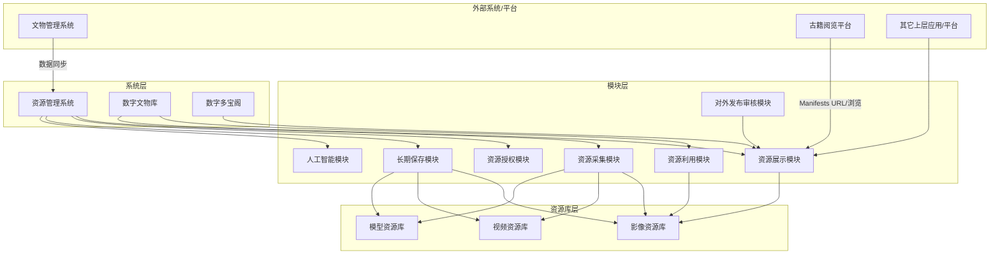

# 3. 总体架构（平台 / 系统 / 模块）
本节结构以 `资源管理需求表.xlsx` 的“系统层级与模块关系表”与 PDF 概要设计为准，并补充流程图 OCR 的系统对接信息。

## 3.1 系统层（入口系统）
| 系统 | 定位 | 典型用户 | 关键能力（与模块/资源库关系） |
|---|---|---|---|
| 资源管理系统 | 数字资源保存与管理的核心系统 | 采集/编目/审核/版权/管理员 | 统一组织模块与资源库能力；提供交互数据接口；触发长期保存 |
| 数字文物库 | 数字资源对外/对内开放平台（以藏品数据为基础） | 公众/研究员/策展人 | 检索、浏览高清大图；收藏/分享；资源申请与利用 |
| 数字多宝阁 | 可移动文物模型资源开放平台 | 公众/运营 | 对外发布三维资源，支持交互浏览与展示 |

## 3.2 资源库层（资产底座）
| 资源库 | 管理对象 | 核心特性 | 必备通用能力 |
|---|---|---|---|
| 影像资源库 | 静态图像（含超高清） | 切片/深度缩放、色彩空间管理、版本多 | 统一ID与版本；Fixity；元数据字典；索引；衍生生成；权限与审计 |
| 视频资源库 | 视频/音频 | 转码、多码率、关键帧与预览 | 同上，并补充转码策略与播放控制 |
| 模型资源库 | 3D 模型/贴图/点云 | 格式与渲染依赖、贴图关系 | 同上，并补充表示信息与渲染衍生 |

## 3.3 模块层（业务能力模块）
| 模块 | 目标 | 关键输出 |
|---|---|---|
| 资源采集模块 | 数据进入系统，保证完整性与可用性 | 入库批次、质检结果、主文件与最小元数据 |
| 资源利用模块 | 馆内/对外利用流程闭环 | 收藏夹/购物车/利用单/申请单；局部截取；交付包 |
| 资源授权模块 | 权利与许可闭环 | 权利状态、协议、使用范围、到期提醒、导出限制 |
| 资源展示模块 | 展示与浏览 | 详情页、缩略瀑布流、IIIF/Mirador 展示、检索控制 |
| 对外发布审核模块 | 对外发布可控、可审计 | 发布工单、审核记录、上线/交付包（DIP） |
| 长期保存模块 | 长期保存与交换 | BagIt 包、PREMIS 事件流、METS 结构、迁移/修复记录 |
| 人工智能模块 | 辅助编目与检索 | 标签/向量/推荐结果；人工校正与审计 |

## 3.4 关键外部系统/平台对接（来自流程图 OCR 与 PDF）
- 文物管理系统：与资源管理系统进行数据同步（资源/元数据/关联对象）。
- 古籍阅览平台：作为展示/访问端之一，对接 manifests URL 与资源展示能力。
- 故宫博物院藏古文字数字平台、藏品总目、故宫名画记/数字多宝阁等：作为上层应用或数据来源/展示端，对接资源展示与检索能力。

## 3.5 总体关系图（Mermaid）

