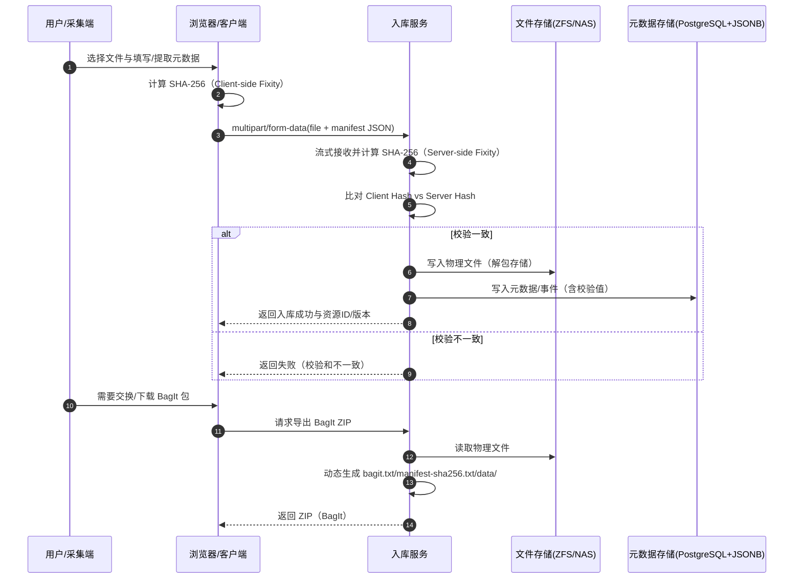
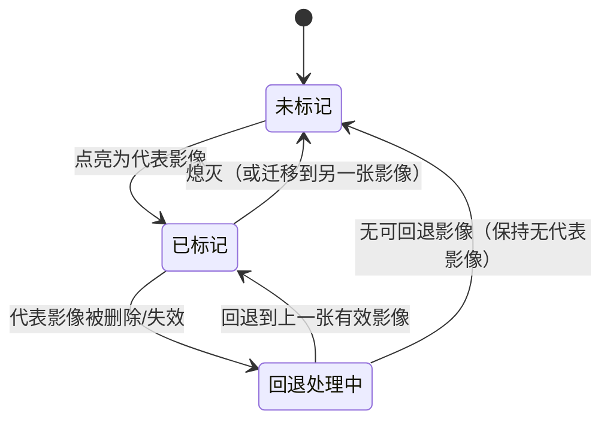
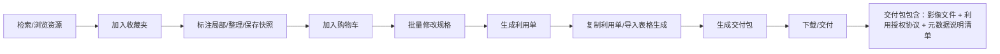
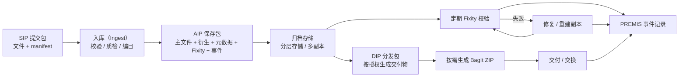

# 4. 关键流程
## 4.1 入库与传输（分离式 SIP + 端到端 Fixity）
依据 `DATA_INGEST_ARCHITECTURE.md`：
- 传输形态：`multipart/form-data` 分两部分上传：`file`（原始二进制流）+ `manifest`（JSON 字符串，含客户端计算 SHA256 与提取元数据）。
- 服务端入库：流式接收文件并计算服务端 Hash，与 manifest 的客户端 Hash 比对；一致后写入存储与数据库。
- 存储形态：解包存储（Unpacked），物理文件直接可被 IIIF 图像服务读取；数据库记录承载元数据。
- 导出形态：按需动态生成标准 BagIt 结构并打包 ZIP 返回（包含 bagit.txt、bag-info.txt、manifest-sha256.txt、data/ 载荷）。

### 4.1.1 入库时序图（Mermaid）


## 4.2 代表影像标记（需求 需-0009）
- UI 形态：点亮/熄灭按钮（必须有强对比视觉反馈，避免误解）。
- 业务规则：点亮代表影像时，将同一文物的“代表影像标签”迁移到当前影像；若当前影像被修改/删除，标签自动回退到之前最后一张有效影像。

### 4.2.1 代表影像状态机（Mermaid）


## 4.3 利用链路（收藏夹 → 购物车 → 利用单 → 交付）
依据 `资源管理需求表.xlsx`：
- 个人中心三件套：收藏夹、购物车、利用单。
- 收藏夹：整理、标注局部、导出、加入购物车；支持保存工作空间快照（需-0007）。
- 购物车：批量修改规格（需-0004）；生成利用单。
- 利用单：可复制（需-0002），可导入表格生成（需-0003），可导出/下载数据（需-0006）。
- 交付包：压缩包除影像外，必须附带“利用授权协议”与“元数据说明清单”（需-0005）。

### 4.3.1 利用链路流程图（Mermaid）


## 4.4 对外发布审核（模块）
- 发布工单：选择资源 → 自动检查授权 → 提交审核 → 生成可对外分发版本（DIP）。
- 审计：所有审核动作、导出动作、发布动作必须可追溯（人、时间、原因、版本、交付内容）。

### 4.4.1 对外发布审核流程图（Mermaid）
```mermaid
flowchart TD
  S[选择资源/版本] --> R{授权校验通过?}
  R -- 否 --> X[拦截并提示补齐授权/调整策略]
  R -- 是 --> T[提交发布工单]
  T --> A[审核]
  A -->|退回| B[补充材料/调整范围]
  B --> A
  A -->|通过| D[生成对外分发版本\n(派生/水印/脱敏)]
  D --> P[发布/交付]
  P --> L[记录审计日志\n操作者/时间/版本/原因/范围]
```

## 4.5 长期保存（BagIt + OAIS + PREMIS + METS）
依据需求 `需-0010` 与 PDF 概要设计：
- 使用 BagIt 封装数字内容，校验数据完整性。
- 按 OAIS 功能对标组织流程与职责。
- PREMIS：记录保存对象/事件/代理（导入、校验、迁移、修复、交付等）。
- METS：组织描述性、技术性、结构性元数据并支持交换。

### 4.5.1 SIP/AIP/DIP 与长期保存闭环（Mermaid）


