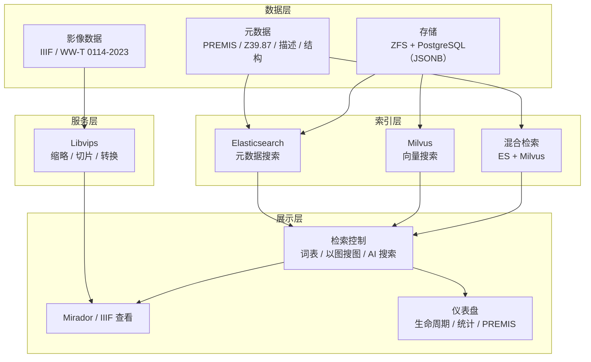

# 5. 影像资源库设计（数据层/索引层/服务层/展示层）
本节以 PDF 概要设计第 3 页内容与 `文物二维影像元数据思维导图.png` OCR 为准。

## 5.0 分层结构图（Mermaid）

## 5.1 数据层：元数据体系（共享 + 分类）
### 5.1.1 元数据分层
- 共享元数据：跨影像类型通用（管理/技术/保存等）。
- 分类元数据：按业务类型/对象差异（可移动文物、不可移动文物、艺术摄影、业务活动、全景、古树、考古等）。

### 5.1.2 共用元数据（管理元数据）字段清单（来自 Excel）
字段以 Excel 为准（是否有词表仅在 Excel 标注“有”的字段强制走词表）：

| 字段 | 是否有词表 |
|---|---|
| 项目类型 | 有 |
| 项目名称 |  |
| 摄影者/制作者 |  |
| 摄影者/制作者单位 |  |
| 版权所有 |  |
| 拍摄/制作时间 |  |
| 影像类别 |  |
| 影像名称 |  |
| 拍摄/制作内容 |  |
| 是否为代表影像 |  |
| 备注 |  |
| 影像标签 |  |
| 属性录入账号 |  |
| 属性录入时间 |  |
| 影像录入时间 |  |
| 原始文件名 |  |
| *影像文件名 |  |
| 对象标识符类型 |  |
| 对象标识符值 |  |
| 文件大小 |  |
| 格式名称 |  |
| 格式版本 |  |
| *格式注册表名称 |  |
| *格式注册表项 |  |
| *字节顺序 |  |
| *消息摘要算法 |  |
| *消息摘要 |  |
| *消息摘要生成器 |  |
| 图像宽度 |  |
| 图像高度 |  |
| 色彩空间 |  |

### 5.1.3 分类元数据字段清单（来自 Excel 全部 sheet）
**可移动文物**
- 文物号、文物名称、文物级别、文物类别、文物细类、管理科组、提照人员、提照人员电话、影像是否只对藏品管理者可见

**不可移动文物**
- 一级区域、二级区域、文物建筑名称、方位、部位一、部位二、部位三、建筑构件

**艺术摄影（含词表标注）**
- 艺术摄影类型（有）、藏品类型（有）、所在宫区、季节、植物、动物、节气、其他、主题、文化专题、展览专题

**业务活动**
- 主要地点、主要人物

**全景**
- 全景类型（备注：全景故宫、展览全景、）、位置

**古树**
- 档案编号、植物类型、植物名称、所在区域、具体位置、等级

**考古**
- 考古影像分类

## 5.2 数据层：数据标准与表示信息（来自 PDF 与 OCR）
- 技术元数据参考 ANSI/NISO Z39.87：Basic Digital Object Information、Basic Image Information、Image Capture Metadata、Image Assessment Metadata、Change History 等。
- 保存元数据参考 PREMIS：Fixity、事件、代理、权利等。
- 影像数据标准参考 IIIF；可移动文物二维数字化采集与加工参考 WW/T 0114—2023。
- 色彩标准：至少支持 sRGB / AdobeRGB 标识与转换策略。

## 5.3 数据存储
- 文件系统：ZFS（按概要设计给出的选型口径）。
- 数据库：PostgreSQL + JSONB 扩展（元数据与事件结构化存储）。

## 5.4 索引层
- 元数据搜索：Elasticsearch
- 向量搜索：Milvus
- 混合检索：Elasticsearch + Milvus（可配置权重）

## 5.5 服务层（影像处理）
- Libvips：缩略图生成、切片图生成、格式转换。

## 5.6 展示层
- 资源展示模块：Mirador（IIIF 查看器）对接。
- 多维度检索控制：受控词表检索、以图搜图搜索框、AI 搜索（自然语言描述 → LLM 解析关键词 → 匹配标签返回检索结果）。
- 详情页：元数据、版本、权利状态、申请与交付、事件摘要。
- 仪表盘：数字资产生命周期管理仪表盘、统计数据仪表盘、PREMIS 事件流。

